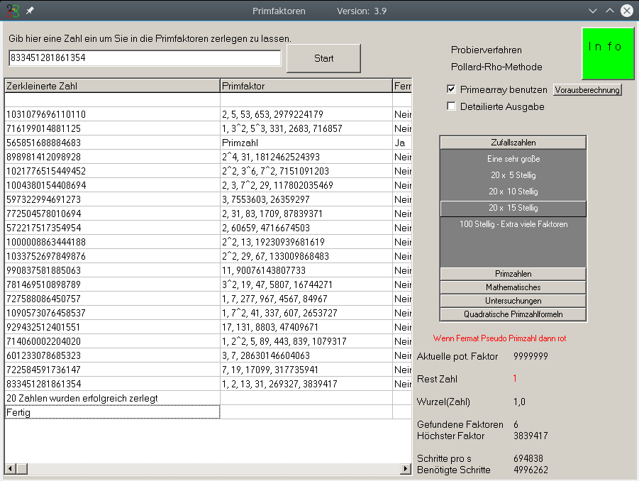

# Primfaktoren

Primfaktoren can factorize **huge** numbers. 

* Using a primefactor array it can find smaller factors extremely fast. If the primefactors get too large it can use the **[Pollard's rho algorithm](https://en.wikipedia.org/wiki/Pollard%27s_rho_algorithm)** to find even larger factors.
* Listing all prime numbers in a certain range
* Find the Greatest Common Factor of huge numbers 
* Find the Least common multiple of huge numbers
* List Fibbonacci numbers
* Calculate the golden ratio to huge precision

